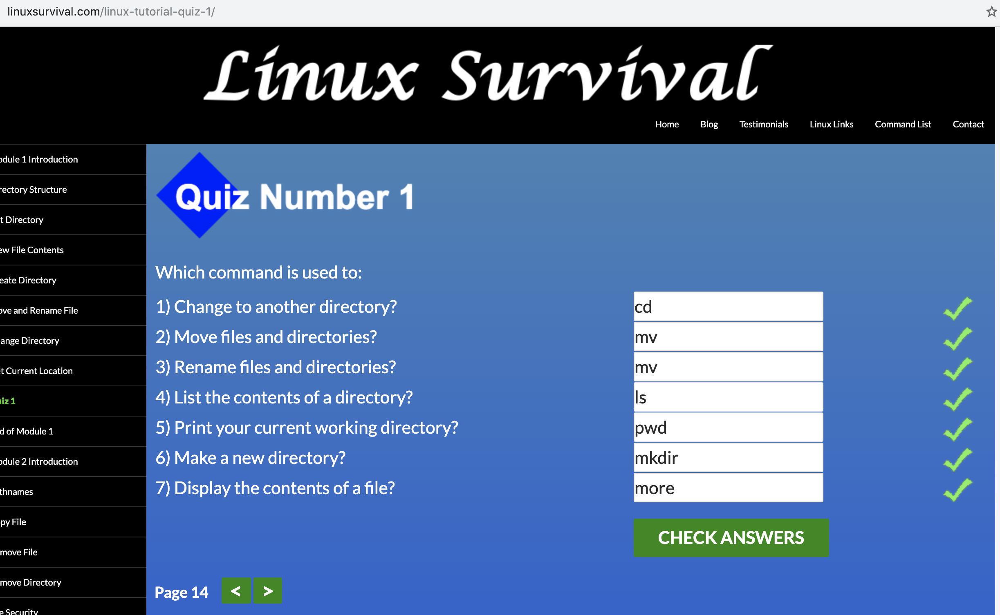
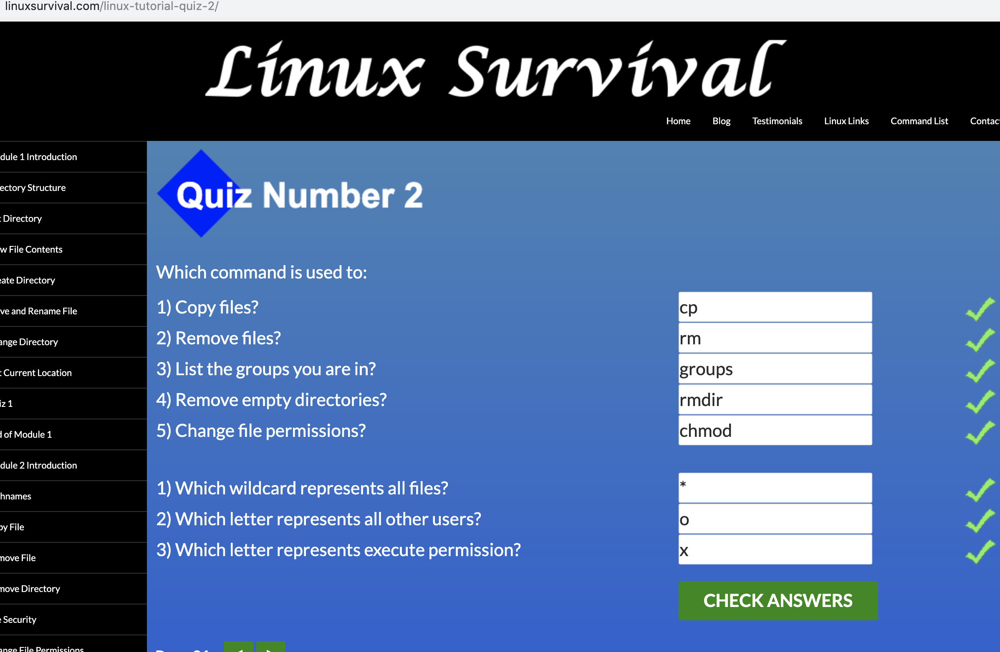
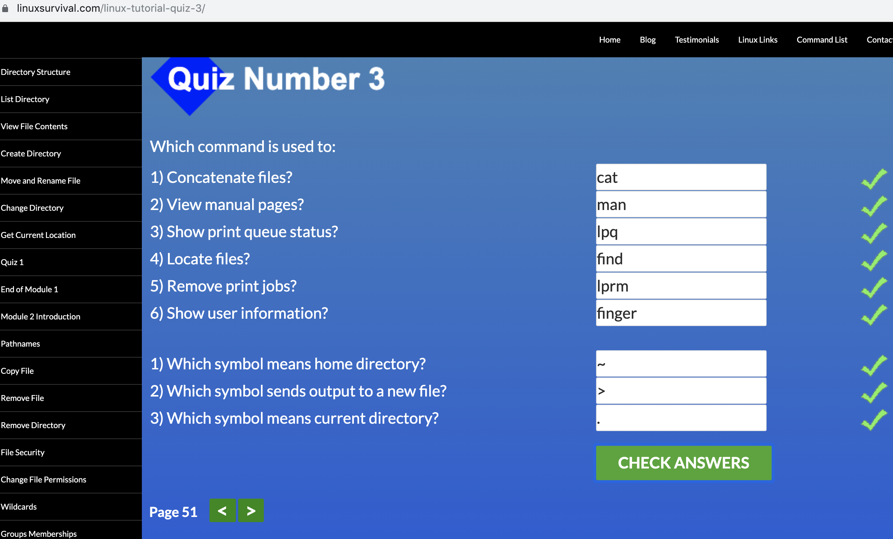
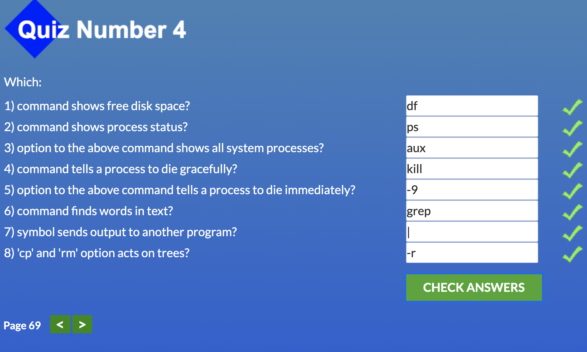
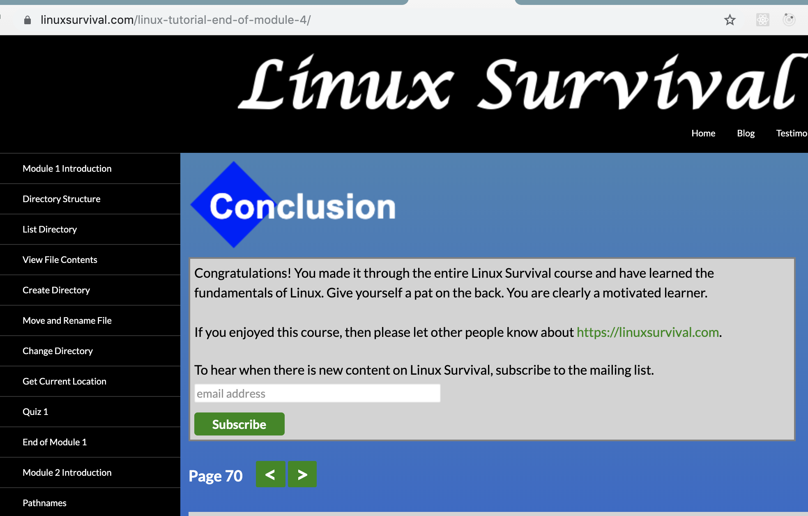
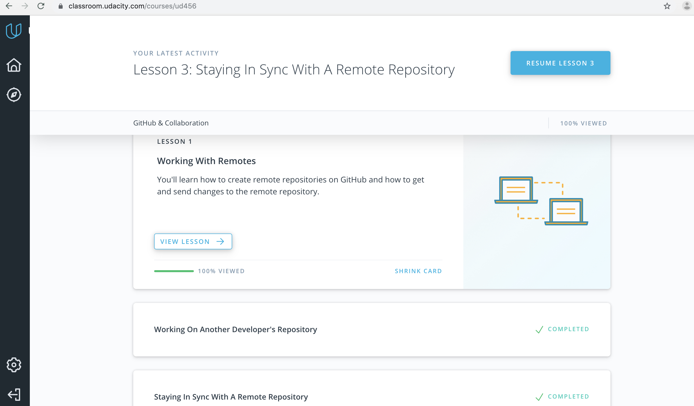

# kottans-backend

## Git basics
### New to me
* git log flags:
`--oneline` - compact format of the git log
`--stat` - display changed files in each commit
`-p` - display changed files content in each commit

### Intent to use in future
* Less navigation hotkeys
to scroll down, press
`j` or `↓` to move down one line at a time
`d` to move by half the page screen
`f` to move by a whole page screen
to scroll up, press
`k` or `↑` to movde _up_ one line at a time
`u` to move by half the page screen
`b` to move by a whole page screen
press q to quit out of the log (returns to the regular command prompt)

### Surprised me
You can generate patches with `git diff -p`

## Unix Shell
### New to me
you can concatenate multiple files content using `cat file1 file2` syntax

### Surprised me
You can add files to the printer queue with `lpr` command

### Intent to use in future
use `grep` more often

## Git Collaboration
### New to me
You can use `git shortlog` to see how many commits each contributor has added to the repository. `-s` shows just the number of commits (rather than each commit's message);`-n` sorts them numerically (rather than alphabetically by author name). `--author` to filter by author name. `--grep` flag to filter output (case sensitive).

### Intent to use in future
squashing the commits `git rebase -i HEAD~1` ~{number} is the number of commits to squash

